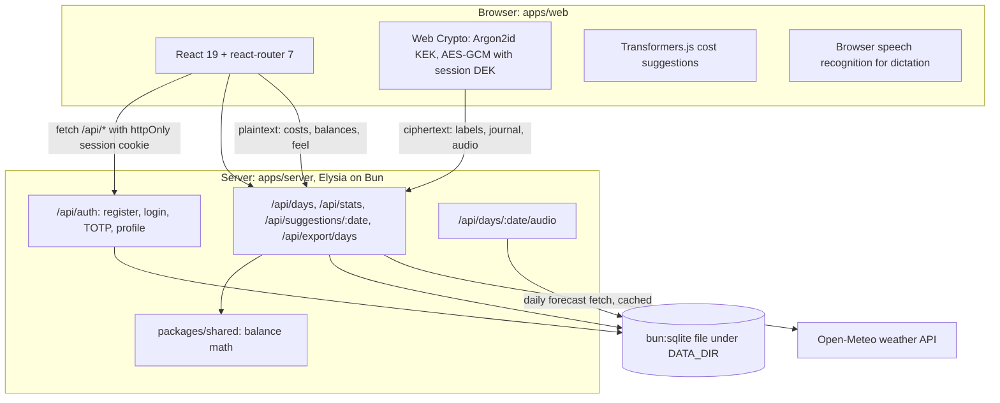
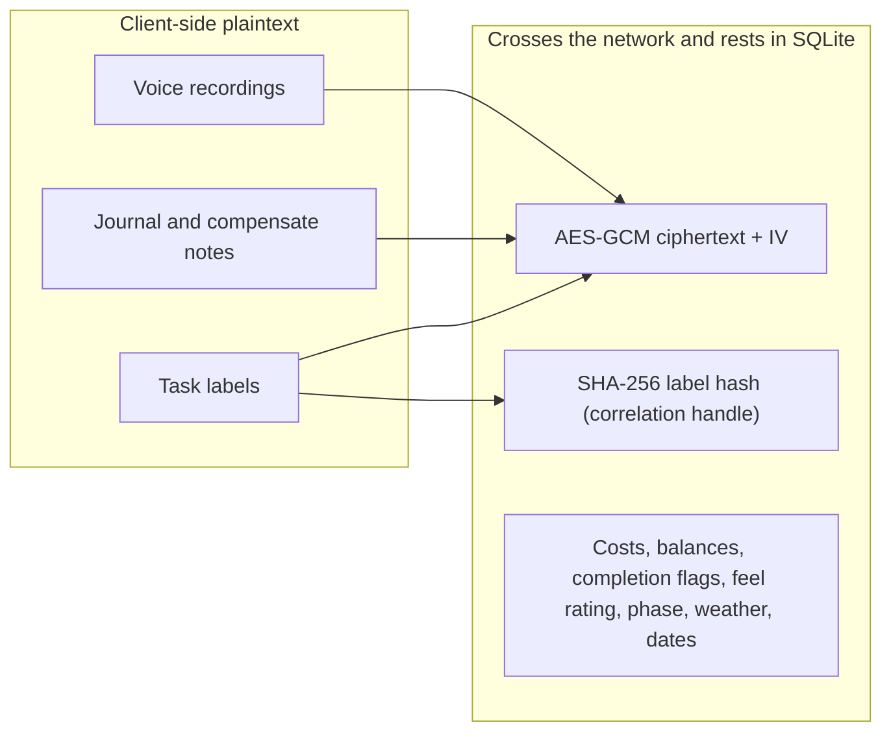

# Architecture

EAJ is a Bun workspace with three packages, namely a browser client in `apps/web`, an API server in `apps/server`, and shared balance math in `packages/shared`. The client is React 19 with Vite and react-router 7, the server is Elysia with Drizzle over `bun:sqlite`, and everything persists to one SQLite file under `DATA_DIR`. The design goal is a single self-hosted process that serves both the API and the built web app, with the sensitive text encrypted before it ever leaves the browser.

## System context

## Workspace layout

| Path | Role |
|------|------|
| `apps/web` | React client, Vite build, all encryption and decryption |
| `apps/server` | Elysia routes, Drizzle schema, session and TOTP handling |
| `packages/shared` | Balance math (`openingBalance`, `closingBalance`, Attwood totals), used by both sides |
| `data/` (or `DATA_DIR`) | SQLite file plus encrypted audio blobs |

The root `package.json` defines the workspace scripts. `bun run dev` starts the API, `bun run dev:web` starts Vite, `bun test` runs the shared, server, and web-lib test suites, and `bun run build` produces `apps/web/dist`, which the server serves as static assets when present.

## Request lifecycle

A request from the client carries an httpOnly session cookie. The server resolves the session in `apps/server/src/lib/session.ts`, loads the user, and hands the route handler a full user row. Day routes go through `ensureDay`, which creates the row for a date on first touch, computes the opening balance from the last closed day, and attaches weather from Open-Meteo when the profile has coordinates. Balance math lives in `packages/shared/src/balance.ts` so the server and the client compute identical numbers by construction.

## The encryption boundary

The client derives a key-encryption key (KEK) from the password with Argon2id and unwraps a data-encryption key (DEK) that was generated in the browser at registration. For convenience, the unlocked DEK is cached in the browser profile for at most 24 hours so refreshes and browser restarts preserve the session; explicit logout and expiry clear it. This weakens at-rest protection on the local browser profile compared with memory-only storage, but labels remain encrypted on the wire and server. Text that could identify what a user actually did is encrypted with AES-GCM before upload; numbers stay clear so the server can chart and aggregate without reading anything personal.

The label hash deserves a note: it is a SHA-256 of the normalized label, stored so the suggestion catalog can recognize a repeated activity without decrypting it. It is a correlation handle, and never plaintext. Trend features, including the dashboard charts and the local insight engine in `apps/web/src/lib/insights.ts`, work exclusively from the numeric column set on the right side of the diagram, so no analytics path requires the DEK. Contextual activity ranking runs only after unlock in `apps/web/src/lib/activitySuggest.ts`; the server returns encrypted catalog entries plus non-sensitive frequency and weekday metadata.

## A day's life

A day moves through three phases, namely `plan`, `audit`, and `closed`. Planning adds deposit and withdrawal lines, each reserving points against the opening balance. The audit phase records actual costs, a feel rating from 1 to 10, and an encrypted journal entry. Closing recomputes the opening balance from the previous closed day, persists the closing balance, locks the sheet against edits, and carries the result into tomorrow. `GET /api/stats` aggregates per-day plaintext numbers (balances, task and completion counts, planned and actual totals) that the client-side insight rules turn into end-of-day observations.
