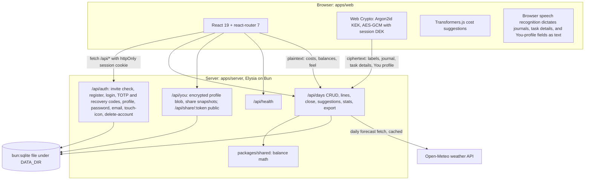
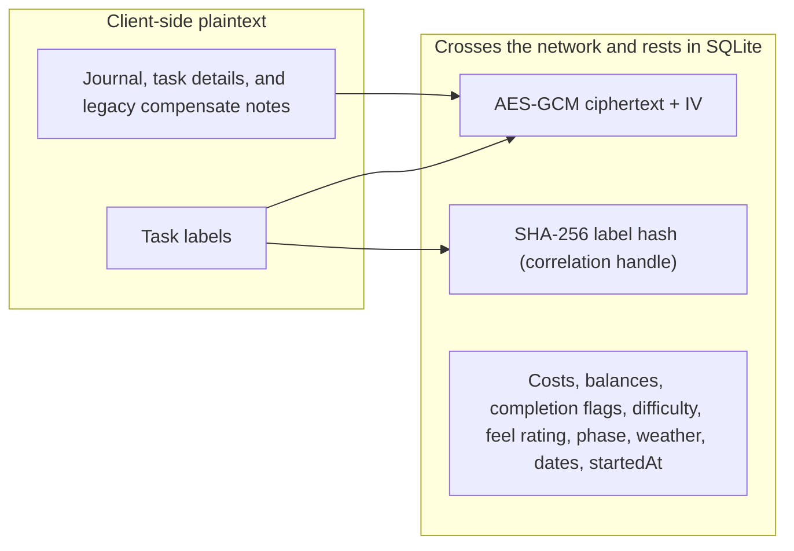

# Architecture

EAJ is a Bun workspace with three packages, namely a browser client in `apps/web`, an API server in `apps/server`, and shared balance math in `packages/shared`. The client is React 19 with Vite and react-router 7. The server is Elysia with Drizzle over `bun:sqlite`. Everything persists to one SQLite file under `DATA_DIR`. The design goal is a single self-hosted process that serves both the API and the built web app, with sensitive text encrypted before it ever leaves the browser.

## System context

## Workspace layout

| Path | Role |
|------|------|
| `apps/web` | React client, Vite build, all encryption and decryption |
| `apps/server` | Elysia routes, Drizzle schema, session and TOTP handling |
| `packages/shared` | Balance math (`DAILY_ENERGY`, `openingBalance`, `closingBalance`, Attwood totals), used by both sides |
| `data/` (or `DATA_DIR`) | SQLite file |

The root `package.json` defines the workspace scripts. `bun run dev` starts the API, `bun run dev:web` starts Vite, `bun test` runs the shared, server, and web-lib test suites, and `bun run build` produces `apps/web/dist`, which the server serves as static assets when present.

## Frontend routes

| Route | Page | Notes |
|-------|------|-------|
| `/auth` | `AuthPage` | Register, login, unlock, TOTP / recovery |
| `/onboarding` | `OnboardingPage` | Wing family and first identity |
| `/` | `TodayPage` | Active energy day |
| `/dashboard` | `DashboardPage` | Trends and previous days |
| `/you` | `YouPage` | Butterfly, traits, encrypted profile, shares |
| `/settings` | `SettingsPage` | Account, TOTP, export, delete |
| `/share/:token` | `SharePage` | Public snapshot view |

Authenticated app routes other than settings redirect through onboarding when the profile is incomplete.

## Request lifecycle

A request from the client carries an httpOnly session cookie. The server resolves the session in `apps/server/src/lib/session.ts`, loads the user, and hands the route handler a full user row. Day routes never auto-create a day on read. The client calls `POST /api/days/start` explicitly, and `GET /api/days/active` returns the one open day or `null`. Days are identified by `id`. The `date` field is the local start label and may repeat across closed days. A partial unique index enforces at most one non-closed day per user. Balance math lives in `packages/shared/src/balance.ts` so the server and the client compute identical numbers by construction.

Signup is invite-gated. `POST /api/auth/invite/check` validates a code, and `POST /api/auth/register` consumes it atomically against `invite_code_table`. Optional TOTP setup issues recovery codes whose hashes are stored on the user row. Login and sensitive settings actions accept either a live authenticator code or one unused recovery code.

## API surface

Auth (`prefix /api/auth`): `POST /invite/check`, `/register`, `/login`, `/totp/verify-login`, `/logout`; `GET /me`, `/touch-icon`; `POST /totp/setup`, `/totp/enable`, `/totp/disable`, `/password`, `/email`, `/delete-account`; `PATCH /profile`.

Days and related (`prefix /api`): `GET /days/active`, `POST /days/start`, `GET /days`, `GET /days/:dayId`, `PATCH /days/:dayId`, `POST /days/:dayId/close`, `DELETE /days/:dayId`; line create/update/delete under `/days/:dayId/lines`; `GET /suggestions/:dayId`, `GET /stats`, `GET /export/days`; `GET /api/health`.

You and share (`prefix /api`): `GET|PUT /you/profile`, `GET|POST /you/shares`, `DELETE /you/shares/:shareId`, `GET /share/:token`.

## Schema notes

Primary tables include `user_table`, `session_table`, `day_table`, `task_line_table`, `task_catalog_table`, `you_profile_table`, `share_snapshot_table`, `invite_code_table`, and `weather_cache_table`. User preferences such as `displayName`, `greetingStyle`, `temperatureUnit`, and `includePhysicalActivities` live as plaintext on the user row. Day rows may carry `weatherJson`, `isHoliday`, and legacy `qualitative_*` plus compensate-note ciphertext columns. The UI no longer writes qualitative blobs or free-text compensate notes. Recovery recommendations replace the old compensate prompt, and the legacy columns remain for old exports and migrations.

## The encryption boundary

The client derives a key-encryption key (KEK) from the password with Argon2id and unwraps a data-encryption key (DEK) that was generated in the browser at registration. For convenience, the unlocked DEK is cached in the browser profile for at most 24 hours so refreshes and browser restarts preserve the session. Explicit logout and expiry clear it. This weakens at-rest protection on the local browser profile compared with memory-only storage, and labels remain encrypted on the wire and server. Text that could identify what a user actually did is encrypted with AES-GCM before upload. Numbers stay clear so the server can chart and aggregate without reading anything personal. Per-task free-form details follow the encrypted boundary, while the optional 1 to 10 difficulty rating stays numeric so local insights can compare it without reading the note.

The label hash deserves a note. It is a SHA-256 of the normalized label, stored so the suggestion catalog can recognize a repeated activity without decrypting it. It is a correlation handle, and never plaintext. Trend features, including the dashboard charts and the local insight engine in `apps/web/src/lib/insights.ts`, work exclusively from the numeric column set on the right side of the diagram, so no analytics path requires the DEK. Contextual activity ranking runs only after unlock in `apps/web/src/lib/activitySuggest.ts`. The server returns encrypted catalog entries plus non-sensitive frequency and weekday metadata.

Phrase and activity catalogs live as JSON under `apps/web/src/content/`, including affirmations, greetings, play prompts, novel activities, movement families, weather quips, and completion quips. They are loaded at build time. TypeScript owns pickers, scoring, and RegExp compilation, including the tips corpus in `apps/web/src/lib/tipsCorpus.ts`. Novel movement suggestions (push-ups, jumping jacks, squats) come from that registry. Each family declares conservative dose tiers, a lower-impact alternative that is always offered, and research provenance. The dose is chosen by `deriveMovementProgress`, which reads only the person's own decrypted catalog (use counts and difficulty means) inside `personalIntelligence.ts`. Unseen variants start tiny, and each variant steps up only on its own repeated comfortable ratings, so wall push-up comfort never escalates floor push-ups and hard ratings hold the dose small. Account preference `includePhysicalActivities` (default true, plaintext on the user row) quietly gates the Energy Guide. When false, movement families and physical novel/play prompts are skipped in favor of seated, social, and creative options, including journaling, reading, calling or texting someone you care about, and mindfulness. Chosen doses are logged as ordinary encrypted labels, so future ratings personalize exactly the path the person picked. All recommendation surfaces flow through the Energy Guide in `apps/web/src/lib/energyGuide.ts`, a deterministic on-device ranker whose every item carries the concrete signals that produced it, so "why this?" is answerable without any server round trip. The legacy compensate-note columns remain in the schema and the corpus export for old data, and the UI now generates a next-day recovery recommendation instead of asking for a free-text note.

## An energy day's life

An energy day moves through three phases: `plan`, `audit`, and `closed`. The user starts it explicitly. It opens with `DAILY_ENERGY` (100) and may remain active across calendar midnights until closed. Planning adds lines for what will add energy and what will use it. Only incomplete use-energy (withdrawal) lines reserve points against that finite supply. Add-energy (deposit) lines restore energy and stay plannable even when uses are fully booked. The API and database retain their legacy internal side enum values for backward compatibility, while the interface consistently uses action language. Completing a use-energy task frees its reservation back into available capacity. The audit phase records actual costs, a feel rating from 1 to 10, and an encrypted journal entry. Closing records energy remaining and moves the day to **Previous days** without creating another one. Previous days open read-only. A closed day never reopens into `plan` or `audit`, and it accepts amendments (line edits, journal, feel rating) via an explicit edit toggle. Each amendment atomically recomputes energy remaining and rebuilds the derived activity catalog when needed, while the live capacity guard does not apply because amendments describe what already happened. After an in-app confirmation, `DELETE /api/days/:dayId` atomically removes only an owned, closed day, cascades its lines, and rebuilds the user's derived activity catalog. Active days cannot be deleted through this history action. The next day begins only when the user chooses **Start new day**, again at 100 with no carry-over. `GET /api/stats` aggregates per-day plaintext numbers (energy remaining, task and completion counts, planned and actual totals, `startedAt`) that the client-side insight rules turn into end-of-day observations.

The lifecycle is intentionally decoupled from midnight because calendar boundaries are unreliable for many neurodivergent schedules, including irregular sleep, long hyperfocus sessions, shift work, and time blindness. These schedules are first-class cases, and the application does not treat them as edge cases to punish.

## Identity, the You profile, and sharing

The butterfly identity system (see [BUTTERFLY.md](BUTTERFLY.md)) adds three data tiers with distinct privacy treatment. The identity config (chosen symbol, wing family and composable wing traits, palette, seed, motion preference) is render-only JSON on the user row, deliberately outside the encryption boundary and allowlisted server-side (`apps/server/src/lib/identity.ts`) so it cannot become a covert channel. It is also cached locally (`apps/web/src/lib/identityCache.ts`) so the full sign-in screen can welcome a returning person before any key is derived. The wing grammar lives in `apps/web/src/lib/butterflyGeometry.ts`. Pure, deterministic functions turn a family plus traits into flat SVG render layers that `Butterfly.tsx` composes. The You profile (about, communication and support notes, accepted traits, color meanings, plus the auto-draft toggle and dismissed-line ids) is one AES-GCM blob per user in `you_profile_table`, encrypted client-side exactly like journal text. Share snapshots in `share_snapshot_table` are the deliberate disclosure path. The client decrypts locally, the person picks sections, and the chosen plaintext is frozen under a 32-byte random token whose SHA-256 alone is stored. Links use a bounded TTL by default, with an explicit permanent-until-revoked option that keeps the selected plaintext stored. Revocation both tombstones the row and deletes the frozen payload. `GET /api/share/:token` is the only unauthenticated data route.

On-device intelligence shares one decrypted model. `apps/web/src/lib/personalData.ts` decrypts the export once into a typed in-memory shape. The daily butterfly state (`apps/web/src/lib/butterflyState.ts`), trait suggestions (`apps/web/src/lib/butterflyTraits.ts`), and the how-to-work-with-me drafter (`apps/web/src/lib/youDraft.ts`) all read from it. They follow the same rule as the Energy Guide: deterministic, on-device, evidence-carrying. State reads only plaintext day numbers. Trait inference and drafting additionally read the catalog and journal decrypted after unlock, and their output goes nowhere unless the person accepts it into their encrypted You profile. Free-text entry everywhere shares one Web Speech capability (`apps/web/src/lib/useDictation.ts`) surfaced through the `DictatableField` and `DictationControl` components.

Account deletion (`POST /api/auth/delete-account`) requires the password, the current TOTP or recovery code when enabled, and a typed confirmation. One user-row delete then cascades through sessions, days, task lines, the catalog, the You profile, and all share snapshots.

## Deployment

One Bun process serves the API and, when present, `apps/web/dist`. There are no background workers or queues. The maintainers host the invite-gated public instance and its SQLite database at [https://eaj.97115104.com/](https://eaj.97115104.com/). Anyone may clone and self-host. End-to-end encryption of labels, journals, task details, and the You profile means the host stores ciphertext and cannot read those fields without the person's password-derived keys. Local development uses `./deploy-locally.sh` with `DATA_DIR` defaulting to `./data`. Production hosting via `./run-service.sh` defaults `DATA_DIR` to `$HOME/.local/share/eaj` and `COOKIE_SECURE=1`. Weather forecasts are fetched from Open-Meteo and cached in `weather_cache_table`. Holiday hints come from `apps/server/src/lib/holidays.ts`.
